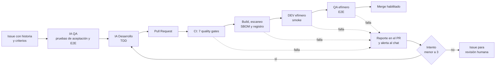

# Parqueadero Central: pipeline DevSecOps con IA

Demo de un ciclo de vida de software asistido por IA: una historia de usuario entra como Issue, la IA crea las pruebas y el código, y un pipeline DevSecOps valida cada cambio con quality gates antes de desplegarlo en ambientes efímeros de DEV y QA. Si algo falla, la IA recibe el reporte, corrige y el ciclo se repite.

El producto de ejemplo, **Parqueadero Central**, es una app ficticia de administración de espacios de parqueo: ingreso y salida de vehículos, validación de placas colombianas, cobro por hora o fracción y reportes.

## Flujo end-to-end



1. **Historia de usuario:** un Issue con la historia y sus criterios de aceptación. La etiqueta `claude-dev` inicia el proceso.
2. **IA QA:** crea las pruebas de aceptación (API) y, si aplica, E2E (interfaz) a partir de los criterios, sin ver la implementación.
3. **IA Desarrollo:** implementa con TDD para que pasen esas pruebas y abre el PR.
4. **CI:** siete quality gates de calidad y seguridad. El ruleset de `main` bloquea el merge si alguno falla.
5. **Build y CD:** la imagen se construye una sola vez, se escanea, se publica y se promueve a DEV y luego a QA.
6. **Retroalimentación:** ante un fallo, el reporte llega al PR y al chat del equipo; la IA corrige hasta 3 veces antes de escalar a una persona.

## Workflows y triggers

| Workflow | Se dispara cuando | Insumos | Resultado |
| --- | --- | --- | --- |
| `claude-dev.yml` | Un Issue recibe la etiqueta `claude-dev` | Título, historia y criterios del Issue; reglas de `CLAUDE.md` | Rama `claude/issue-N` con commits `qa`, `test` y `feat`, y un PR |
| `quality-pipeline.yml` | Se abre o actualiza un PR, o hay un push a `main` | Código del PR y configuración de cada gate | Gates, imagen publicada y despliegues en DEV y QA |
| `claude-fix.yml` | El Quality Pipeline falla en un PR de la IA | Gates fallidos y log del error | Reporte en el PR y corrección de la IA (máximo 3 intentos) |
| `notificaciones.yml` | Termina el Quality Pipeline | Resultado del run | Mensaje al chat del equipo |

## Quality gates

| Stage | Gate | Herramienta | Bloquea si |
| --- | --- | --- | --- |
| CI | TDD verificado | `scripts/check-tdd.js` | Hay cambios en `app/` sin cambios en pruebas |
| CI | Integridad de pruebas de aceptación | `scripts/check-acceptance-integrity.js` | Un commit que no es de QA modifica `tests/acceptance/` o `tests/e2e/` |
| CI | Secretos en el código | Gitleaks | Se detecta una clave, token o contraseña |
| CI | Análisis estático | ESLint | Hay errores de lint |
| CI | Pruebas unitarias y de aceptación | Jest | Falla alguna prueba o la cobertura es menor al 80 % |
| CI | Dependencias vulnerables (SCA) | OSV-Scanner | Hay vulnerabilidades conocidas |
| CI | Calidad y seguridad del código (SAST) | SonarQube Cloud | No se aprueba el Quality Gate (bloqueante en PRs) |
| Build | Seguridad de la imagen | Trivy | Hay vulnerabilidades altas o críticas con solución disponible |
| DEV | Smoke | curl | La app no responde o no carga |
| QA | E2E de aceptación | Playwright | Algún criterio de aceptación no se cumple |

Todos son obligatorios en el ruleset **Proteger main**: todo cambio entra por PR y nadie puede saltarse los gates, ni siquiera el dueño del repositorio.

## Artefactos

La imagen se construye **una sola vez por commit** y ese mismo artefacto se promueve de DEV a QA. El SHA del commit identifica la imagen de punta a punta.

| Stage | Artefacto | Dónde se consulta |
| --- | --- | --- |
| CI | Reporte de cobertura | Artefacto `coverage` del run |
| CI | Resultados de Gitleaks y OSV-Scanner | Artefactos SARIF del run y pestaña Security |
| CI | Análisis y Quality Gate | SonarQube Cloud y comentario en el PR |
| Build | Imagen `ghcr.io/<owner>/<repo>:<sha>` | Packages del repositorio |
| Build | Escaneo de Trivy y SBOM (CycloneDX) | Artefacto `imagen-reportes` del run |
| DEV y QA | Registro de despliegues | Environments `dev` y `qa` |
| QA | Reporte HTML de Playwright | Artefacto `playwright-report` del run |

## IA en el pipeline

La IA trabaja en tres procesos separados, cada uno con permisos limitados por carpeta. Los controles son técnicos, no solo instrucciones.

| Proceso | Qué hace | Puede modificar |
| --- | --- | --- |
| QA | Crea pruebas de aceptación y E2E desde los criterios; commit `qa(#N)` | `tests/acceptance/` y `tests/e2e/` |
| Desarrollo | Implementa con TDD; commits `test(#N)` y `feat(#N)`; abre el PR | `app/` y `tests/unit/` |
| Corrección | Lee el reporte del gate fallido y corrige la causa raíz | `app/` y `tests/unit/` |

**Controles:** lista cerrada de comandos permitidos, gate de integridad sobre las pruebas de QA, reglas por rol en `CLAUDE.md` (nunca bajar umbrales, borrar pruebas ni modificar workflows), máximo 3 intentos de corrección, límite de pasos y de tiempo por ejecución, y límite de gasto en la API.

## Notificaciones

| Evento | Mensaje |
| --- | --- |
| Pipeline aprobado | ✅ Título, rama, validación en DEV y QA, imagen y enlace al run |
| Quality gate fallido | ❌ Título, rama, gates fallidos y enlace al run |
| La IA está corrigiendo | 🤖 PR, número de intento y gates fallidos |
| Revisión humana requerida | 🚨 PR y gates fallidos tras agotar los intentos |

Los mensajes se envían a un webhook de Google Chat (`CHAT_WEBHOOK_URL`). El mismo mecanismo funciona con cualquier canal que acepte webhooks, como Slack o Teams.

## Crear un proyecto nuevo

El script `scripts/nuevo-proyecto.ps1` crea un repositorio desde esta plantilla y lo deja listo en menos de un minuto:

```powershell
powershell -ExecutionPolicy Bypass -File .\scripts\nuevo-proyecto.ps1 -Nombre mi-proyecto
```

Qué hace, en orden: crea el repositorio desde la plantilla, configura los secretos, crea las etiquetas y los ambientes `dev` y `qa`, crea el proyecto en SonarQube Cloud (desactivando su análisis automático), ajusta `sonar-project.properties`, sube esa configuración a `main` (lo que dispara el primer pipeline) y crea el ruleset con los 10 gates obligatorios. Es reanudable: si se interrumpe, al ejecutarlo de nuevo con el mismo nombre continúa donde quedó.

**Requisitos:** GitHub CLI autenticado (`gh auth login`) y Git. Las GitHub Apps de Claude y SonarQube Cloud deben tener acceso a los repositorios nuevos. Los secretos se leen de variables de entorno o se piden de forma oculta; nunca se guardan en archivos.

## Uso

### Desarrollar una historia con IA

1. Crea un Issue con la historia de usuario y sus criterios de aceptación en formato Dado/Cuando/Entonces.
2. Agrégale la etiqueta `claude-dev`.
3. Sigue el avance en **Actions → Claude Dev**: primero el job de QA y luego el de Desarrollo.
4. Revisa el PR que abre la IA: commits separados por fase, criterios cubiertos y resultado de los gates.
5. Con todos los gates en verde, haz merge. El Issue se cierra automáticamente.

### Ejecutar la app en local

```powershell
npm install
npm start          # http://localhost:3000
npm run lint
npm run test:coverage
npm run test:e2e   # requiere la app corriendo en http://localhost:3000
```

## Configuración

| Elemento | Dónde |
| --- | --- |
| Reglas de la IA por rol | `CLAUDE.md` |
| Umbrales de los gates | `jest.config.js`, `eslint.config.js`, `sonar-project.properties` |
| Excepciones de Gitleaks (revisadas y justificadas) | `.gitleaks.toml` |
| Pruebas E2E | `playwright.config.js` y `tests/e2e/` |
| Imagen de la app | `Dockerfile` (multietapa, sin npm, usuario sin privilegios) |
| Secretos | `ANTHROPIC_API_KEY`, `SONAR_TOKEN` y `CHAT_WEBHOOK_URL` en GitHub Actions |
| Protección de `main` | Ruleset **Proteger main** |

## Decisiones de diseño

- **La imagen se construye una vez y se promueve.** Lo que se prueba en QA es exactamente lo que pasó los gates.
- **El Quality Gate de SonarQube bloquea en los PRs.** En `main` el análisis actualiza la línea base sin bloquear, porque todo lo que llega a `main` ya pasó por el gate en su PR. Esto también permite que un proyecto nuevo pase su primer pipeline, cuando SonarQube aún no puede calcular el gate.
- **Las excepciones de seguridad se documentan, no se desactivan gates.** `.gitleaks.toml` excluye solo la clave de proyecto de SonarQube, que es un identificador público, y deja activas todas las demás reglas.
- **Los ambientes son efímeros.** DEV y QA se levantan como contenedores en el runner, se prueban y se destruyen al terminar; en un entorno real vivirían en la nube.
- **Desarrollo y pruebas son procesos separados.** El proceso que implementa no puede modificar las pruebas que lo validan.

## Evolución natural

Despliegue a producción con estrategias Blue/Green o Canary, firma de artefactos, pruebas de contrato, DAST contra el ambiente de QA, ambientes en la nube y observabilidad.
